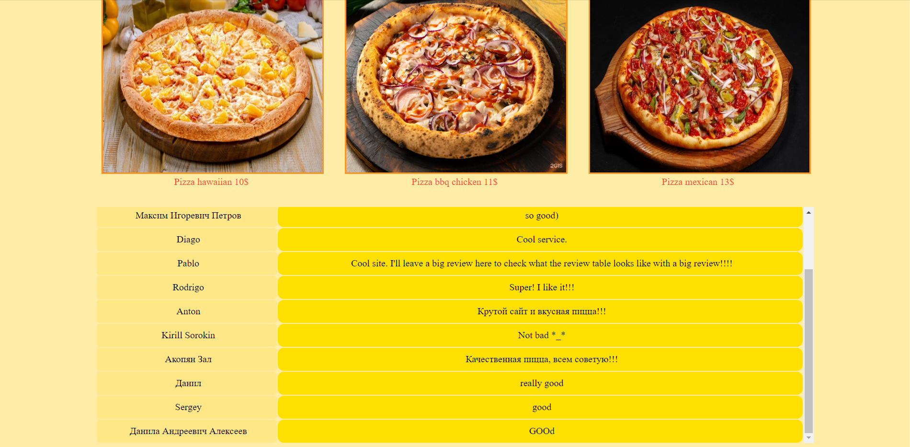

# How to install and run
1. Clone the repository
``` 
git clone https://github.com/lxvdnl/pizza-ordering-web.git 
```
2. Install node.js
3. Including dependencies
```
cd pizza-ordering-web
npm install
```
4. Start the server
```
node server.js
```
5. Now you can visit the site: http://localhost:3000

# Website presentation
* ## Main page where you can choose pizza
<p align="center">
  
</p>

* ## On the same page below is a table of reviews
<p align="center">
  
</p>

* ## After choosing a pizza, you are taken to a page with a choice of additional ingredients
<p align="center">
  
</p>

* ## After selecting additional ingredients, you need to enter personal information
<p align="center">
  
</p>

* ## Next, you will be asked to leave a review
<p align="center">
  
</p>

* ## Next, you return to the main page and if you left a review, it appears in the reviews table
<p align="center">
  
</p>
